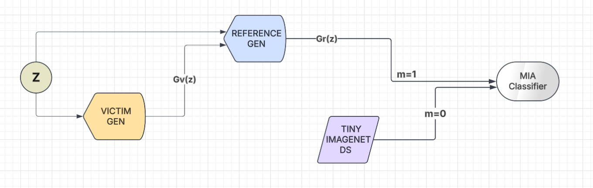

# Membership Inference Attack on GANs

This repository contains the implementation of a Membership Inference Attack (MIA) on Generative Adversarial Networks (GANs). The attack aims to determine whether a specific data point was used in training a target model, which has significant implications for privacy and security in machine learning systems. This implementation is performed in black-box setting where the attacker has limited access to the victim model.


## Table of Contents
- [Overview](#overview)
- [Attack Workflow](#attack-workflow)
- [Implementation Details](#implementation-details)
  - [Shadow Model Architecture](#shadow-model-architecture)
  - [Membership Classifier](#membership-classifier)
  - [Noise Vector Optimization](#noise-vector-optimization)
- [Results and Analysis](#results-and-analysis)
- [Getting Started](#getting-started)
- [Dependencies](#dependencies)
- [References](#references)

## Overview

Membership Inference Attacks (MIA) attempt to determine whether a particular data point was part of a model's training dataset. This implementation specifically targets Generative Adversarial Networks (GANs) to investigate potential privacy leakage in generative models.

The attack consists of three main components:
1. A shadow model (surrogate generator) $G_r$ that mimics the behavior of the victim generator $G_v$
2. A membership classifier that distinguishes between "members" (images generated by $G_v$) and "non-members" (random images from Tiny ImageNet200)
3. An optimization approach to improve attack performance across different generators.

## Attack Workflow



The attack is conducted in several stages:

1. **Data Collection**: In real-world setting, the attacker does not have access to the victim generator $G_v$. So, we train a shadow model $G_r$ to mimic the behavior of $G_v$. This is done by obtaining (noise vector, image) pairs from the victim generator, where noise vectors (Z) are inputs and images are outputs.

2. **Shadow Model Training**: Later we train our shadow model ($G_r$ surrogate generator) to mimic the victim generator. For this the shadow model $G_r$ is used to generate images from the same noise vectors to create a membership classification dataset. Two approaches are explored for training the shadow model:
    - **Pure Reconstruction Loss**: Minimizes MSE between generated images and target images
    - **Minimax + Reconstruction Loss**: Combines adversarial loss with reconstruction loss

3. **Membership Classification Dataset Construction**:
   - Members (Label 1): Images generated by the shadow model $G_r$, which are similar to the images generated by the victim generator $G_v$ exploiting the similarity in their latent spaces over the shared noise vector space.
   - Non-members (Label 0): Random images from Tiny ImageNet200. Any other Dataset can be used as well, except the victim generator's training dataset ie `CelebA` in this case.

4. **Membership Classifier Training**: We design and train a CNN-based classifier to distinguish between member and non-member images. The classifier is trained on the membership classification dataset constructed in the previous step. The main objective is to maximize the accuracy of the classifier in distinguishing between the member and non-member images helping the attacker to infer if a given image was generated by the victim generator $G_v$ or not. (This is the main objective of the attack).

5. **Noise Vector Optimization**: Optimize the input noise vectors to improve attack performance. Herein, we explore two approaches:
    - **Gradient-based Optimization**: Minimize the difference between membership predictions for victim generator and shadow generator outputs
    - **Direct Optimization**: Directly optimize the noise vector Z to maximize membership confidence

## Implementation Details

### Shadow Model Architecture

The shadow model (surrogate generator) is implemented as a deep convolutional generator with self-attention mechanisms:

```python
class Generator(nn.Module):
    def __init__(self, z_dim, img_channels, features_g):
        super().__init__()
        self.gen = nn.Sequential(
            self._block(z_dim, features_g * 16, 4, 1, 0),
            self._block(features_g * 16, features_g * 8, 4, 2, 1),
            SelfAttention(features_g * 8),
            self._block(features_g * 8, features_g * 4, 4, 2, 1),
            self._block(features_g * 4, features_g * 2, 4, 2, 1),
            nn.ConvTranspose2d(features_g * 2, img_channels, 4, 2, 1),
            nn.Tanh()
        )
```

### Membership Classifier

The membership classifier is a CNN-based model that takes an image as input and outputs a binary classification (member/non-member):

```python
class MembershipClassifier(nn.Module):
    def __init__(self, in_channels=3, fmap=128, num_classes=2):
        super().__init__()
        self.conv = nn.Sequential(
            nn.Conv2d(in_channels, fmap, 3, 2, 1),
            nn.LeakyReLU(0.1),
            nn.BatchNorm2d(fmap),
            nn.Conv2d(fmap, fmap*2, 3, 2, 1),
            nn.LeakyReLU(0.1),
            nn.BatchNorm2d(fmap*2),
            nn.Conv2d(fmap*2, fmap*4, 3, 2, 1),
            nn.LeakyReLU(),
        )
        self.classifier = nn.Sequential(
            nn.Linear(fmap*4*8*8, 256),
            nn.ReLU(),
            nn.Dropout(0.4),
            nn.Linear(256, 128),
            nn.ReLU(),
            nn.Linear(128, num_classes)
        )
```

The membership classifier is trained to distinguish between:
- Images generated by the victim generator (members)
- Images from Tiny ImageNet200 (non-members)

<!--  -->

### Noise Vector Optimization

Two approaches are explored for optimizing noise vectors:

**Approach 1: Gradient-based Optimization**
- Minimize the difference between membership predictions for victim generator and shadow generator outputs
- Loss function: `L = SmoothL1Loss(MembershipClassifier(G_v(Z)), MembershipClassifier(G_r(Z)))`

**Approach 2: Direct Optimization**
- Directly optimize the noise vector Z to maximize membership confidence
- Loss function: `L = BCE(MembershipClassifier(G_v(Z)), [0, 1])`


## Results and Analysis

The results show:

1. **Shadow Model Performance**: The pure reconstruction loss model outperformed the minimax + reconstruction loss model in mimicking the victim generator.

2. **Membership Classifier Accuracy**: The classifier achieved 95% accuracy in distinguishing between member and non-member images.

3. **Noise Vector Optimization**: Approach 2 showed better convergence and improved attack performance compared to Approach 1. 

## Getting Started

### Installation

```bash
git clone https://github.com/your-username/gan-membership-inference-attack.git
cd gan-membership-inference-attack
pip install -r requirements.txt
```

### Usage

1. **Prepare the Dataset**:
```python
# Prepare membership classification dataset
prepare_tiny_imagenet_dataset(
    source_root=source_root,
    output_dir="Membership_classifier_dataset/0",
    classes=tiny_imagenet_classes,
    images_per_class=250
)
```

2. **Train the Shadow Model**:
```python
# Train with reconstruction loss only
train_generator_reconstruction_only(gen, train_loader, num_epochs=120)

# Or train with minimax + reconstruction loss
train_minimax_plus_reconstruction(gen, disc, train_loader, num_epochs=125, MSE_FACTOR=0.3)
```

3. **Train the Membership Classifier**:
```python
mem_class_opt = optim.Adam(Membership_classifier.parameters(), lr=LEARNING_RATE)
criterion = nn.CrossEntropyLoss()

NUM_EPOCHS_MEM_CLASS = 5
for epoch in range(NUM_EPOCHS_MEM_CLASS):
    for id, (x,y) in enumerate(mem_classifier_loader):
        y_pred = Membership_classifier(x)
        loss = criterion(y_pred, y)
        
        mem_class_opt.zero_grad()
        loss.backward()
        mem_class_opt.step()
```

4. **Optimize Noise Vector**:
```python
# Approach 2 (recommended)
optimized_noise_vector = optimize_z_for_mia_A2(
    optim_Z_train_loader, 
    Membership_classifier, 
    num_epochs=50, 
    learning_rate=3e-4
)
```

## Dependencies

- PyTorch
- NumPy
- Pandas
- scikit-learn
- matplotlib
- tqdm
- Pillow
- wandb (for experiment tracking)

## References

- [Membership Inference Attacks Against Machine Learning Models](https://arxiv.org/abs/1610.05820)
- [GAN-Leaks: A Taxonomy of Membership Inference Attacks against GANs](https://arxiv.org/abs/1909.03935)
- [Label-Only Membership Inference Attacks](https://arxiv.org/abs/2007.14321)
